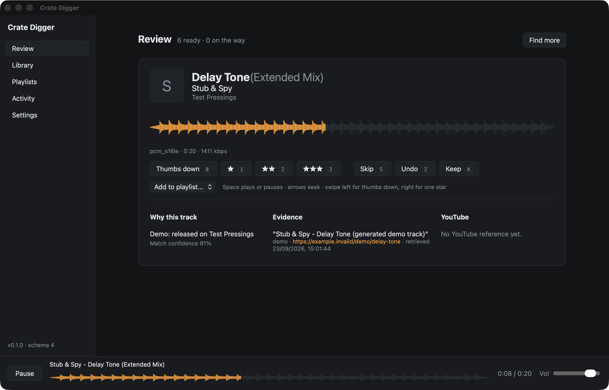

# Crate Digger

A free, open-source desktop app that keeps a DJ's queue full of new music worth hearing.



Crate Digger finds tracks through the places DJs already dig (Discogs artist and label relationships, tracklists, forum and editorial pages, text you paste) and downloads them from Soulseek. It checks and analyses each file, then ranks everything by your own ratings. You rate tracks as they play; your ratings reshape the queue and point discovery in new directions. Keepers go to your archive and your playlists, and playlists export to Rekordbox.

Everything runs on your computer. The AI model can be local (Ollama, LM Studio) or an API. Your logins stay in the operating system's keychain.

## What works today

- **Library**: import folders, play and edit tags, rate any track, and detect duplicates and different versions of the same track by audio fingerprint. A background job identifies tracks through AcoustID and MusicBrainz and fills in release, label, year and genre, without touching your files.
- **Library map**: every analysed track placed by how it sounds, with clusters, nearest neighbours, and colour by playlist, year, genre, label or release country. Select tracks to add to a playlist or use as discovery seeds.
- **Review queue**: rate with one key, skip, undo; see why each track was suggested and the evidence behind it.
- **Discovery**: Discogs, public pages (robots.txt respected) and pasted text. Model suggestions stay unverified until a real source confirms them. Discovery can refresh every six hours.
- **Downloads**: a managed copy of [slskd](https://github.com/slskd/slskd), or your own. A calibrated matching rule prefers lossless, then 320 kbps MP3. You choose from a ranked list unless you turn on unattended downloads.
- **Analysis**: tempo, key, loudness and a pretrained music embedding, computed in a separate process.
- **Ranking**: taste clusters from your ratings, with dislikes, source evidence and 20% exploration.
- **YouTube references**: confirmed video links you can correct.
- **Playlists**: ordered playlists with M3U8 and Rekordbox XML export.
- **Shared catalogue (optional)**: sign in with Google to back up your ratings and playlists, and, if you choose, share identified tracks and reuse analyses others agree on. The [service](https://github.com/timini/crate-digger-service) is built but not yet hosted.
- **Pilot report**: a local report comparing ranking with and without your taste, for the [pilot evaluation](docs/pilot-evaluation.md).

Not yet done: a hosted catalogue and signed release builds (see the [release checklist](docs/release-checklist.md)).

## Installing

Release builds will be attached to [GitHub releases](https://github.com/timini/crate-digger/releases) for macOS (Apple Silicon and Intel), Windows x64 and Linux x64. Until signing is set up:
- on macOS, open the app from the context menu the first time;
- on Windows, choose "More info" and "Run anyway" in the SmartScreen prompt.

Your library database, analyses and settings live in the app's data folder:
- macOS: `~/Library/Application Support/io.github.timini.cratedigger`
- Windows: `%APPDATA%\io.github.timini.cratedigger`
- Linux: `~/.local/share/io.github.timini.cratedigger`

Credentials are kept in the operating system's credential store, never in that folder. Uninstalling leaves the data folder in place; delete it by hand to remove everything. Your music files are never changed or deleted by uninstalling.

## Documents

- [Product specification](docs/product-spec.md) and [implementation plan](docs/implementation-plan.md)
- Milestone plans with acceptance evidence: [1](docs/milestone-1-plan.md), [2](docs/milestone-2-plan.md), [3](docs/milestone-3-plan.md), [4](docs/milestone-4-plan.md)
- Calibration reports: [identity](docs/identity-calibration.md), [download matching](docs/acquisition-calibration.md), [ranking](docs/ranking-calibration.md)
- Decisions: [analysis model](docs/decisions/0001-analysis-model.md), [dependencies and licences](docs/decisions/0002-dependencies.md), [central service](docs/decisions/0003-central-service.md)
- [Library map](docs/library-map.md), [pilot evaluation protocol](docs/pilot-evaluation.md), [release checklist](docs/release-checklist.md)

## Development

Requirements: Rust (stable), Node 24 and pnpm 11. On Linux, also the [Tauri system packages](https://v2.tauri.app/start/prerequisites/) and `libasound2-dev`.

```sh
cd app
pnpm install
pnpm tauri dev          # run the app
pnpm test               # frontend tests
cargo test --workspace  # Rust tests (from the repo root)
scripts/check.sh        # everything CI checks, from the repo root
```

To index a folder from the command line (useful for trying a real library):

```sh
cargo run --release -p cd-core --example import -- <database.sqlite> <music folder>
```

Layout:

- `crates/core`: domain model, SQLite schema and migrations, jobs, library, archive and adapter interfaces. No UI and no network access.
- `crates/audio`: decoding, playback, waveforms and fingerprints.
- `crates/analyzer`: the analysis worker (tempo, key, loudness, embeddings).
- `crates/connectors`: everything that talks to the network: models, Discogs, pages, YouTube, slskd, the keychain.
- `app/src-tauri`: the Tauri shell that wires the core to the UI.
- `app/src`: the Svelte and TypeScript interface.

Set `CRATE_DIGGER_DATA_DIR` to use a data directory other than the platform default.

## Open-source intention

The intended application will be open source. The code licence will be selected after implementation dependencies are evaluated. This repository does not yet grant a software licence. Access and licensing terms for any hosted shared catalogue will be specified separately before that service launches.
